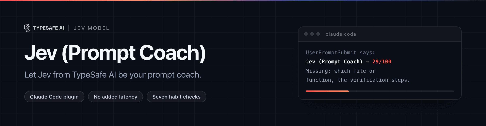

<div align="center">



<p>
  <a href="https://github.com/CrowdLinker/JevPromptCoach/actions/workflows/ci.yml"></a>
  
  
</p>

[English](README.md) · [Français](README.fr.md) · **Español**

</div>

Puntúa lo bien que escribes prompts para un agente de código, y muestra si tus
hábitos están mejorando. Funciona con el modelo Jev de
[TypeSafe](https://typesafe.ai).

No añade nada al tiempo entre pulsar Enter y recibir la respuesta.

> **Plugin comunitario no oficial.** Sin afiliación, respaldo ni soporte de
> TypeSafe ni de Anthropic. Tú pones tu propia clave de API de TypeSafe.

---

## Por qué existe

La mayoría de las herramientas de calidad de prompts ponen un modelo de lenguaje
entre tú y tu agente. Puntúan el prompt antes de enviarlo, lo que significa una
ida y vuelta por la red en cada mensaje.

Jev (Prompt Coach) no se pone ahí. En su modo por defecto el hook añade una
línea a un archivo local y termina. La puntuación ocurre cuando tú la pides, en
un comando.

Lo segundo que hace distinto: puntúa los prompts que **ya has escrito**. Repasar
un año de historial local de Claude Code cuesta unos seis centavos, porque Jev
cobra 0,042 $ por millón de tokens de entrada y nada por la salida. Tienes un
informe el primer día en lugar de dentro de dos semanas.

## Requisitos

- **Node 22 o superior** — `node --version`
- **Claude Code 2.1.x o superior.** Los hooks `UserPromptSubmit` declarados por
  un plugin no se ejecutaban en algunas versiones anteriores, y el plugin
  depende de ellos.
- **Una clave de API de TypeSafe**, desde
  [console.typesafe.ai](https://console.typesafe.ai/settings/keys).

El plugin empaqueta sus propias dependencias en `dist/`. No hay paso de
instalación, ni `node_modules`, ni nada que se descargue en tiempo de ejecución,
y el único host que contacta es `api.typesafe.ai`.

Claude Code es un binario nativo y no trae su propio Node, así que el Node de tu
`PATH` es el que ejecuta el hook. Node 22 es el mínimo, y la CI prueba 22 y 24.

## Instalación

**1. Añade el marketplace e instala el plugin.**

```
claude plugin marketplace add CrowdLinker/JevPromptCoach
claude plugin install jevpromptcoach@jevpromptcoach
```

Confirma que cargó — el estado debe ser `enabled`:

```
claude plugin list
```

**2. Dale tu clave de API.**

Crea primero el archivo, restringe sus permisos, y solo entonces pon la clave
dentro — así la clave nunca existe en un archivo legible por todos, ni aparece
en una línea de comandos que tu shell guardaría en el historial:

```
mkdir -p ~/.claude/jevpromptcoach
touch ~/.claude/jevpromptcoach/.env
chmod 600 ~/.claude/jevpromptcoach/.env
```

Luego abre `~/.claude/jevpromptcoach/.env` en tu editor y añade una línea:

```
TYPESAFE_API_KEY=tu-clave-aqui
```

Ahí es donde el plugin busca la clave. Un hook no se ejecuta bajo el perfil de
tu shell, así que una clave exportada solo en `.zshrc` puede no llegarle nunca,
y el modo `always` la necesita aquí. El plugin nunca escribe este archivo, nunca
registra la clave, y nunca deja que entre en un mensaje de error.

`TYPESAFE_API_KEY` en el entorno sigue teniendo prioridad si tienes motivo para
definirla — así la suministran la CI y la eval — pero el archivo es lo que
conviene usar a diario.

**3. Comprueba que funciona.**

```
/jevpromptcoach:config
```

Imprime tu modo, tu nivel de privacidad, si encontró la clave, y cuántos prompts
se han registrado. Envía uno o dos prompts y vuelve a ejecutarlo — si la cuenta
no sube, el hook no se está disparando, y
[docs/HOOK-BEHAVIOUR.md](docs/HOOK-BEHAVIOUR.md) explica por qué (en inglés).

## Configuración

**Elige un modo.** El valor por defecto es `on-demand`, que nunca añade latencia.
Cámbialo solo si quieres una puntuación en cada mensaje:

```
/jevpromptcoach:config mode always
```

**Elige un nivel de privacidad.** El valor por defecto es `redact`. Si los
prompts de tu trabajo no deben salir nunca de la máquina:

```
/jevpromptcoach:config privacy metadata_only
```

**Repasa tu historial.** Esto es lo que merece la pena hacer el primer día:

```
/jevpromptcoach:config backfill
```

Imprime cuántos prompts encontró y cuánto costarán, y no envía nada hasta que
confirmes. Con 1.039 prompts costó 0,06 $.

Después:

```
/jevpromptcoach:report
```

**Desinstalar.** `claude plugin uninstall jevpromptcoach@jevpromptcoach` quita
el plugin pero deja tus datos. Para borrarlos también, elimina
`~/.claude/jevpromptcoach/`.

## Comandos

Los comandos de plugin llevan prefijo, y el prefijo no siempre es opcional — un
agente lanzado con Task o `@mención` no puede resolver la forma corta. Escribe
siempre el nombre completo.

### `/jevpromptcoach:score <texto>`

Puntúa un borrador **antes** de enviarlo. Es la superficie didáctica: imprime la
puntuación, cada comprobación como aprobada / fallida / no aplicable, y para
cada fallo la causa, la consecuencia y el arreglo — y luego reescribe *tu* texto
para que pase.

Sin argumento, se explica a sí mismo y muestra un ejemplo. No da error.

### `/jevpromptcoach:report [N]`

Patrones en los últimos N prompts registrados, 200 por defecto. Tasa de acierto
por comprobación, tendencia a 30 días, y **un** hábito en el que trabajar. No
siete.

Ver [docs/EXAMPLE-REPORT.md](docs/EXAMPLE-REPORT.md) para uno real, generado
sobre 1.040 prompts de historial (en inglés).

### `/jevpromptcoach:config`

Modo, nivel de privacidad, repaso del historial y borrado del registro.

```
/jevpromptcoach:config                      muestra los ajustes actuales
/jevpromptcoach:config mode always          puntúa en línea mientras escribes
/jevpromptcoach:config privacy metadata_only
/jevpromptcoach:config backfill             estimación, luego confirmación
/jevpromptcoach:config clear                borra el registro local
```

## Las siete comprobaciones

Hábitos propios de trabajar con agentes de código, no prompt engineering
genérico. Las siete viajan en **una sola** petición a Jev por prompt.

| Comprobación | Qué busca |
| --- | --- |
| Nombra el archivo o la función | Un nombre real, no "el código" ni "eso" |
| Dice qué significa "terminado" | Qué debe ser cierto cuando el trabajo esté hecho |
| Se ciñe a un solo requisito | Un cambio concreto, no varios juntos en un mensaje |
| Dice qué no debe cambiar | Lo que tiene que quedarse como está |
| Da el error real | El texto del error, o qué esperabas frente a qué pasó |
| Pide un plan primero | Pedir ver el enfoque antes de un cambio grande o arriesgado |
| Da los pasos de verificación | La prueba o el comando que lo demostraría |

Dos son condicionales: el error real solo se evalúa en informes de fallo, y el
plan primero solo en peticiones grandes o destructivas. El resto se marca `n/a`
en lugar de contarse como fallo.

No se puntúan en absoluto: los comandos slash, las respuestas de una palabra,
cualquier cosa de menos de 15 caracteres, y los mensajes que inyecta Claude Code.

## Los dos modos

### `on-demand` (por defecto) — cero latencia añadida

El hook añade una línea a un registro JSONL local y termina con código 0. Sin
llamada de red, sin importar el cliente de Jev.

Coste medido: **27 a 31 ms** por prompt, de los cuales unos 20 ms son el
arranque del proceso de Node. Está completamente fuera de la ruta de red.

### `always` — un aviso corto, no bloqueante

El hook además puntúa el prompt e imprime un aviso corto mientras el prompt sigue
su curso.

Garantías:

- **Nunca sale con código 2.** En `UserPromptSubmit`, el código 2 bloquea el
  prompt y *borra lo que escribiste*. Todas las rutas de fallo salen con 0.
- **Un tiempo límite estricto** (4 s por defecto). Si Jev no responde a tiempo,
  no se imprime nada.
- **`*` lo salta.** Un prompt que empieza por `*` nunca se registra ni se
  puntúa.
- **Solo hallazgos defendibles.** Dos comprobaciones quedan excluidas de la
  línea en pantalla según la evidencia de la eval, y cualquier cosa cerca de un
  umbral se descarta en lugar de mostrarse.
- **Sin 0/100.** Cuando no pasa ninguna comprobación decidida, el aviso muestra
  lo que falta, sin el número.

**Los seguimientos se leen en contexto.** El primer prompt de una sesión se
puntúa solo. Un prompt posterior se envía con los dos prompts anteriores de la
misma sesión, y solo se puntúa el nuevo. Activado por defecto;
`JEVPROMPTCOACH_SESSION_CONTEXT=0` lo desactiva. Los umbrales se calibraron con
prompts puntuados solos.

## Privacidad

Los prompts contienen código, rutas y a veces secretos.

**El registro es local.** `~/.claude/jevpromptcoach/`, en modo `0600`. Nada sale
de tu máquina salvo durante un comando que tú hayas ejecutado.

| Nivel | Qué se guarda y se envía |
| --- | --- |
| `redact` (por defecto) | El texto del prompt con credenciales, correos y segmentos de ruta identificativos eliminados. Los nombres de archivo sobreviven. |
| `metadata_only` | Solo rasgos derivados — longitud, número de palabras, si hay un bloque de código, si hay una ruta. Nunca el texto. Puntuar necesita texto, así que esto apaga la puntuación. |
| `raw` | El texto tal cual. Las cadenas con forma de credencial se eliminan **igualmente**. |

Se eliminan en todos los niveles, incluido `raw`: `sk-`, `sk-ant-`, `sk-proj-`,
`ghp_` y similares, `AKIA`/`ASIA`, `AIza`, los `xox*` de Slack, JWT, bloques
PEM, secretos de cliente de Azure, tokens `Bearer`, y cualquier cosa asignada a
un nombre que acabe en `KEY`/`TOKEN`/`SECRET`/`PASSWORD`.

**Qué se envía exactamente, y cuándo:**

| Cuándo | Qué va a `api.typesafe.ai` |
| --- | --- |
| `/jevpromptcoach:score` | El único prompt que pasaste, depurado |
| `/jevpromptcoach:report` | Los prompts registrados sin puntuar, depurados, por lotes |
| `config backfill` | Tu historial, depurado, por lotes — **después** de una estimación de coste y una confirmación explícita |
| modo `always` | Cada prompt al enviarlo, depurado, más hasta dos prompts anteriores de la misma sesión como contexto, también depurados |
| En cualquier otro momento | Nada |

Sin telemetría. Sin ningún otro destino de red. La clave de API se lee del
entorno o del archivo de clave, y nunca se registra, se imprime ni se incluye en
un mensaje de error.

Un prompt se puntúa una sola vez. Los resultados se cachean por hash del
contenido, salvo un seguimiento en modo `always`, cuyo contexto cambia.

## Contribuir

[CONTRIBUTING.md](CONTRIBUTING.md) tiene el detalle (en inglés). Dos reglas son
absolutas: **ninguna credencial y ningún texto de prompt llega jamás a un
commit** — ni el tuyo ni el de nadie.

Eso se hace cumplir, no se pide. `scripts/check-leaks.mjs` se ejecuta como hook
de pre-commit, dentro de `npm test`, y otra vez en CI en cada pull request.

---

> **La referencia completa está en inglés.** Este documento cubre la instalación
> y el uso. Las cifras de la eval por comprobación y su validación cruzada, la
> señal de resultado que se midió y se descartó, el comportamiento real de la
> API de hooks de Claude Code, y por qué `dist/` se commitea sin lockfile están
> en [README.md](README.md). Esa es la referencia: si algo aquí diverge, manda
> ella.

## Licencia

MIT, para el código. Ver [LICENSE](LICENSE).

Los nombres y los logos no están incluidos — haz un fork del código, pero
renómbralo y quítale la marca Crowdlinker. TypeSafe, Jev, Claude y Claude Code
pertenecen a sus respectivos dueños. [TRADEMARKS.md](TRADEMARKS.md) detalla
quién reclama qué (en inglés).

---

<div align="center">

<a href="https://crowdlinker.com"></a>

<sub>Mediciones, no impresiones. Si aquí hay un número equivocado, abre una issue con lo que mediste.</sub>

</div>
